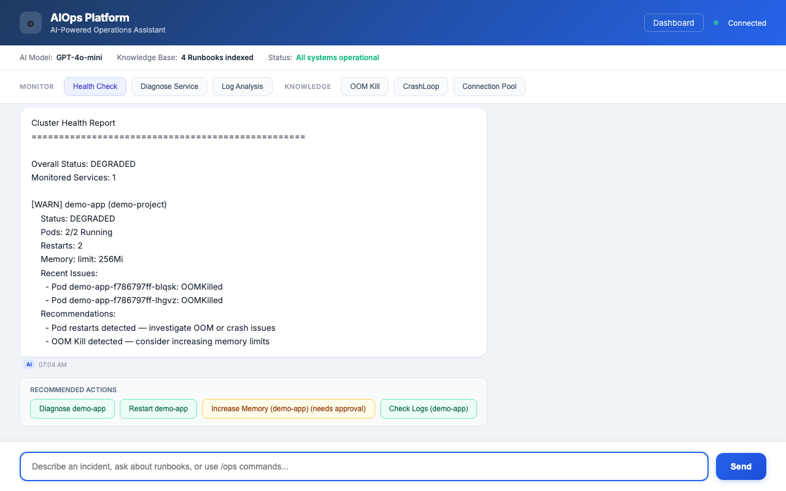
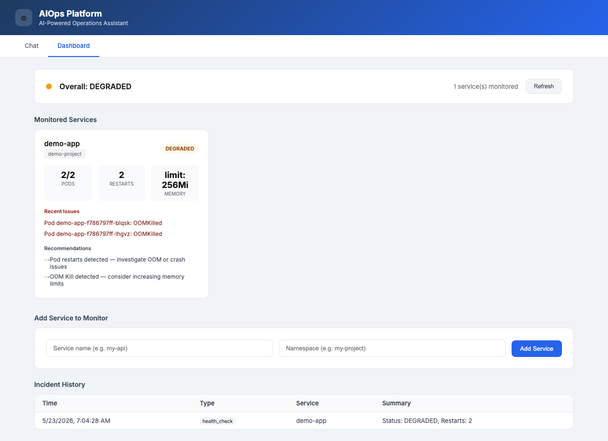

# AIOps Platform

AI-Powered Operations Platform that automatically monitors, diagnoses, and remediates infrastructure issues on OpenShift.

## What It Does

When your services experience issues (Pod crashes, OOM kills, high error rates), this platform:

1. **Detects** — Prometheus monitors your services and triggers alerts
2. **Diagnoses** — AI Agent analyzes logs, queries knowledge base, identifies root cause
3. **Remediates** — Automatically executes low-risk fixes (restart, scale up); requests approval for medium/high-risk actions
4. **Records** — Every incident, diagnosis, and action is stored in incident history

## Architecture

```
┌─────────────────────────────────────────────────────┐
│  Monitored Services (demo-project, healthy-project)  │
│  Pod metrics + logs                                  │
└──────────────────────┬──────────────────────────────┘
                       │ Prometheus scrapes metrics
                       ▼
┌─────────────────────────────────────────────────────┐
│  Prometheus + AlertManager (OpenShift built-in)      │
│  Alert rules → webhook                              │
└──────────────────────┬──────────────────────────────┘
                       │ POST /api/v1/agent/alert
                       ▼
┌─────────────────────────────────────────────────────┐
│  AIOps Platform (aiops-platform namespace)           │
│                                                     │
│  ┌─────────┐  ┌─────────┐  ┌──────────────┐        │
│  │ AI Agent│  │   RAG   │  │ Log Analyzer │        │
│  │LangGraph│  │ChromaDB │  │   + LLM      │        │
│  └────┬────┘  └────┬────┘  └──────┬───────┘        │
│       │            │               │                │
│  ┌────▼────────────▼───────────────▼────┐           │
│  │         Execution Engine             │           │
│  │  Low risk → auto-execute             │           │
│  │  Med/High risk → approval required   │           │
│  └──────────────────────────────────────┘           │
│                                                     │
│  Web UI: Chat Interface + Dashboard                 │
└─────────────────────────────────────────────────────┘
```

## Features

- **RAG Knowledge Base** — Query runbooks with natural language; AI answers based on your documentation
- **AI Agent** — LangGraph state machine: classify → gather context → diagnose → recommend
- **Auto-Remediation** — Low-risk actions execute automatically; medium/high-risk need approval
- **ChatOps** — `/ops health`, `/ops diagnose`, `/ops logs`, `/ops restart`, `/ops scale`
- **Real-time Dashboard** — Service status cards, pod health, restart history, incident log
- **Multi-service Monitoring** — Add/remove services dynamically via API or Dashboard
- **Prometheus Integration** — AlertManager webhook → automatic diagnosis and remediation
- **Incident History** — Every alert, diagnosis, and action recorded with timestamps

## Tech Stack

| Component | Technology |
|-----------|-----------|
| Language | Python 3.11 |
| API Framework | FastAPI |
| AI Framework | LangChain + LangGraph |
| LLM | OpenAI GPT-4o-mini |
| Vector DB | ChromaDB (in-memory) |
| Container Platform | OpenShift 4.21 on AWS |
| Monitoring | Prometheus + AlertManager |
| Build | OpenShift Binary Build (Docker strategy) |

## Quick Start

### Prerequisites

- OpenShift cluster (4.x) with admin access
- `oc` CLI installed
- OpenAI API key

### Deploy

```bash
# 1. Login to cluster
oc login --token=<token> --server=<api-server>

# 2. Create projects
oc new-project aiops-platform
oc new-project demo-project

# 3. Build and deploy (see GUIDE_CN.md for full steps)
oc new-build --binary --strategy=docker --name=aiops-platform -n aiops-platform
oc start-build aiops-platform --from-dir=. --follow -n aiops-platform

# 4. Access
oc get route aiops-platform -n aiops-platform
```

See the deployment section below for setup instructions.

## API Endpoints

| Method | Path | Description |
|--------|------|-------------|
| GET | `/` | Chat Web UI |
| GET | `/dashboard` | Dashboard UI |
| GET | `/api/v1/health` | Health check |
| POST | `/api/v1/knowledge/query` | Query knowledge base (RAG) |
| POST | `/api/v1/agent/alert` | Receive alert (AlertManager compatible) |
| POST | `/api/v1/agent/diagnose` | Manual diagnosis |
| POST | `/api/v1/logs/analyze` | Log analysis |
| POST | `/api/v1/chatops/message` | ChatOps message handler |
| POST | `/api/v1/executor/execute` | Execute remediation action |
| POST | `/api/v1/executor/approve` | Approve pending action |
| GET | `/api/v1/monitoring/dashboard` | Dashboard data |
| GET | `/api/v1/monitoring/services` | List monitored services |
| POST | `/api/v1/monitoring/services` | Add service to monitoring |
| GET | `/api/v1/monitoring/incidents` | Incident history |

## Project Structure

```
.
├── src/
│   ├── main.py                 # FastAPI app entry point
│   ├── config/settings.py      # Configuration (env vars, LLM setup)
│   ├── api/endpoints/          # HTTP endpoints
│   ├── agent/                  # AI Agent (LangGraph workflows, tools, prompts)
│   ├── rag/                    # RAG engine (loader, indexer, vector store, retriever)
│   ├── log_analyzer/           # Log pattern clustering + AI analysis
│   ├── chatops/                # ChatOps command handler
│   ├── executor/               # Remediation engine (K8s API via httpx)
│   ├── monitoring/             # Health checks, config, incident store
│   └── static/                 # Web UI (index.html, dashboard.html)
├── knowledge_base/             # Runbooks and SOPs
├── Dockerfile
├── requirements.txt
└── README.md
```

## Screenshots

### Chat Interface
AI-powered operations assistant with quick action buttons and intelligent remediation suggestions.



### Dashboard
Real-time service monitoring with health status, pod metrics, and incident history.



## Known Limitations (v1)

- **Metrics**: `get_metrics` tool returns mock data (Prometheus query integration planned for v2)
- **Persistence**: Monitoring config and incident history stored in `/tmp/` (lost on pod restart). Database-backed storage planned for v2.
- **Authentication**: No auth on the web UI or API. Production deployment should add OAuth/OIDC.
- **Kubernetes SDK**: Uses `kubernetes` Python library with manual token injection due to OpenShift 4.21 compatibility issues with `load_incluster_config()`.

## License

MIT

